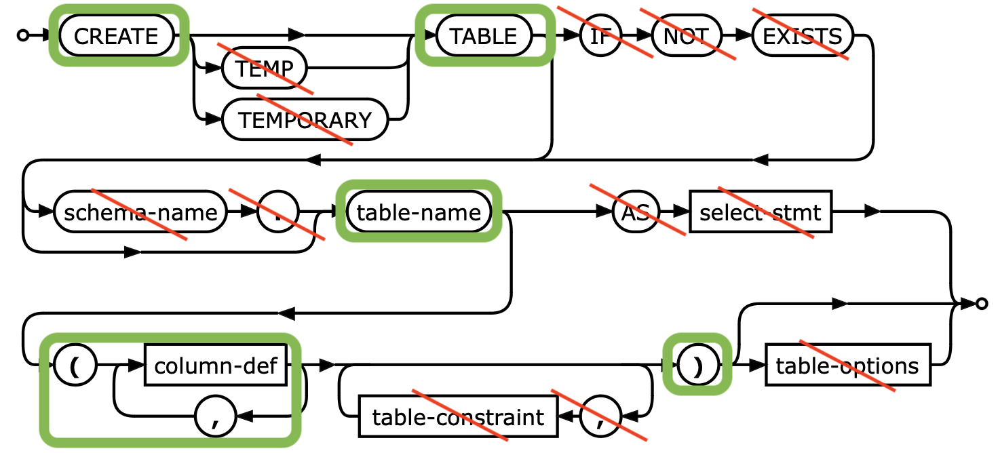

# SQLrc

## TODO

- [ ] joins
- [ ] select aliases
- [ ] generated file warranty
- [ ] capitalized params warranty

## Limitations

Table definition:

Each column must start with new string!

If in column definitions, tokens `PRIMARY KEY` or `NOT NULL`
are not found, codegen outputs warning

Original docs: <https://www.sqlite.org/lang_createtable.html>
